# Java_8_9_10_11_12_13
- URL : https://www.udemy.com/course/java-latest-programming-from-zero-java13-java12-java11-java10-java9-j8/learn/lecture/17818988#overview

## Section 1: Introduction

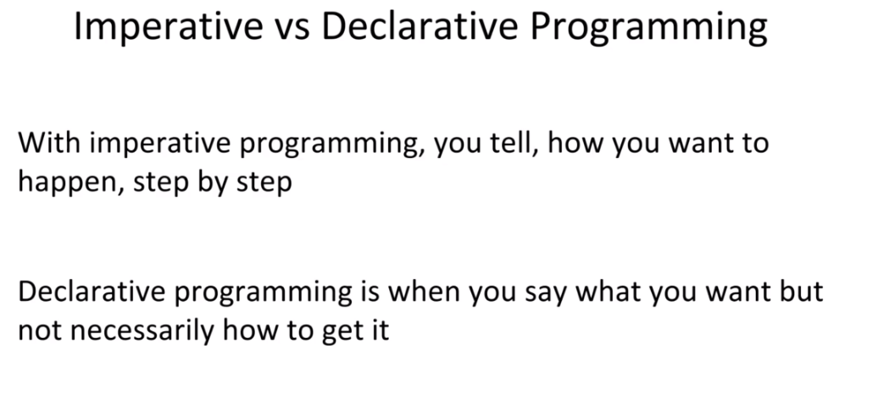
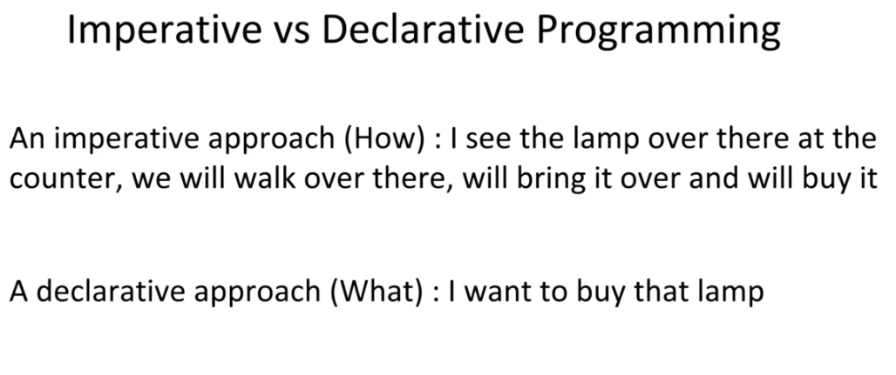
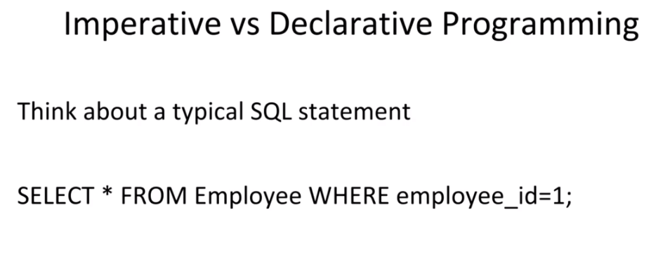
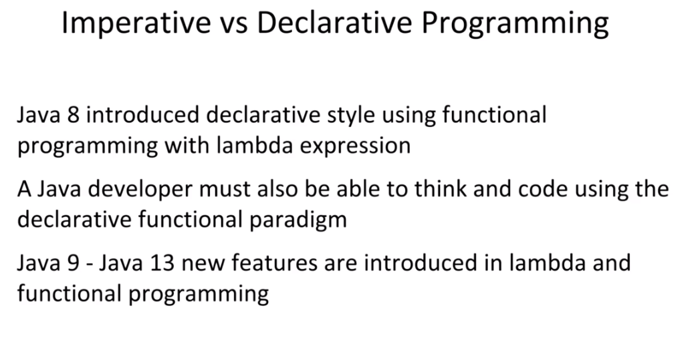
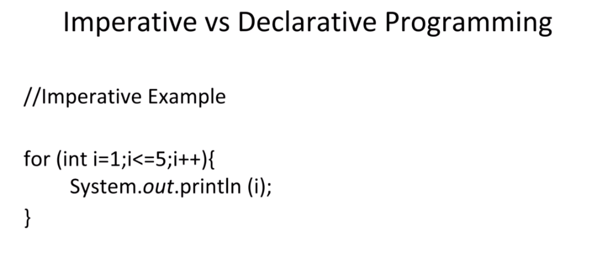
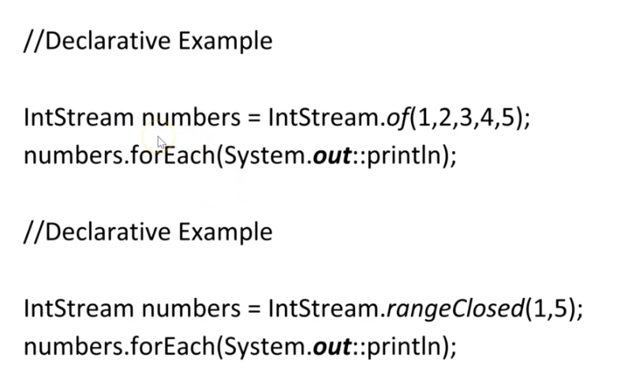
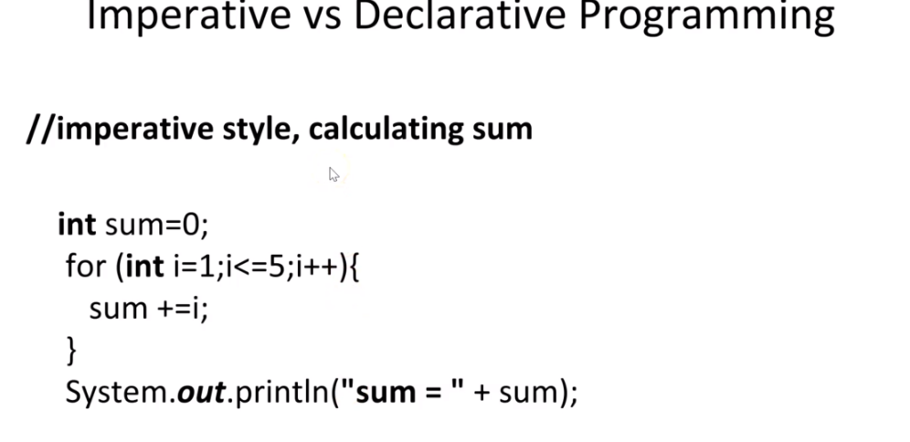
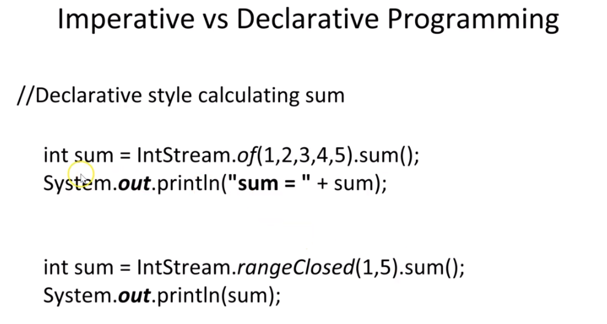
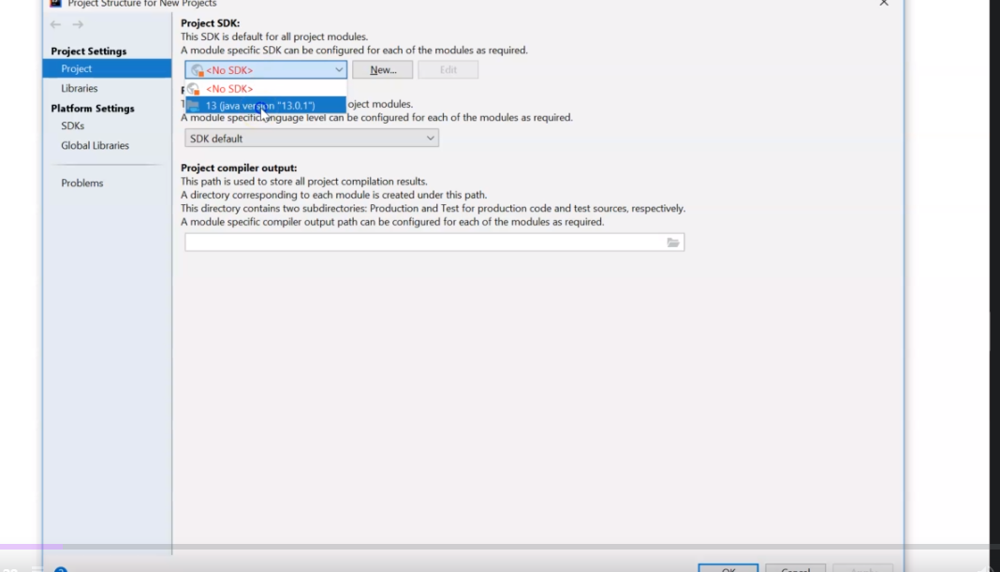

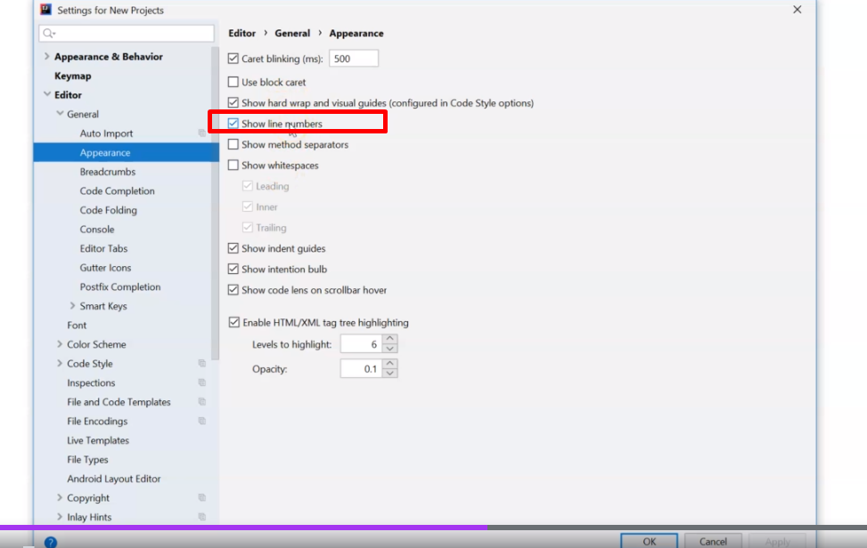
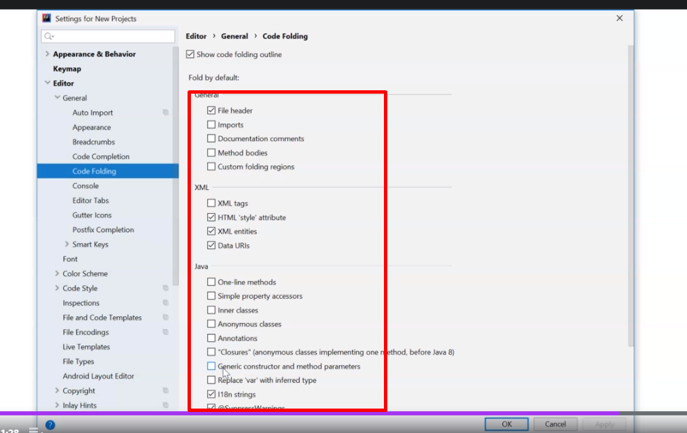

---

## Section 2: Lambda Expressions

* Example 
https://github.com/jdbirla/JD_JAVA_Learning/blob/master/Java_8_9_10_11_12_13/LambdaExpression/src/com/modernjava/lambda/SumOfNumbersUsingCallable.java

---
## Section 3: Functional Interfaces and Lambda

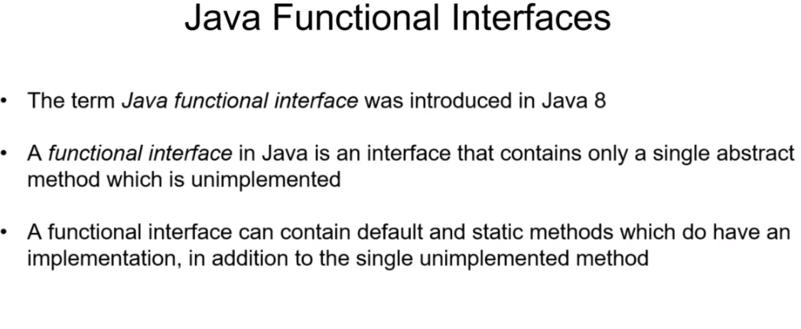
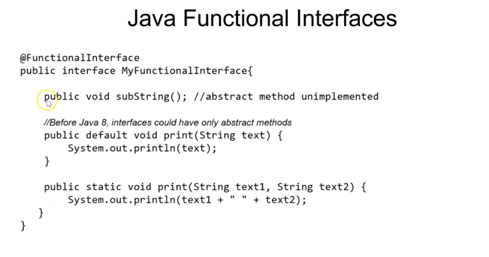
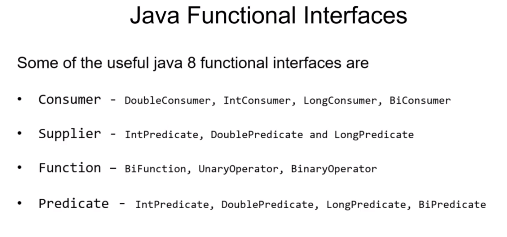
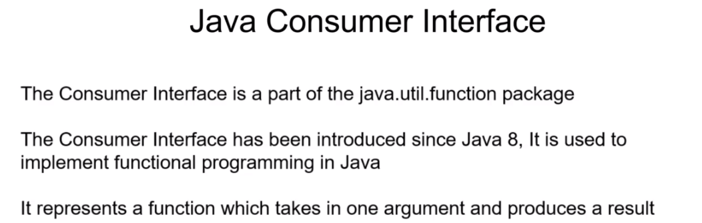

* Consumer example 
1. https://github.com/jdbirla/JD_JAVA_Learning/blob/master/Java_8_9_10_11_12_13/LambdaExpression/src/com/modernjava/funcprogramming/ConsumerExample.java
2. https://github.com/jdbirla/JD_JAVA_Learning/blob/master/Java_8_9_10_11_12_13/LambdaExpression/src/com/modernjava/funcprogramming/ConsumerExample2.java
3. https://github.com/jdbirla/JD_JAVA_Learning/blob/master/Java_8_9_10_11_12_13/LambdaExpression/src/com/modernjava/funcprogramming/ConsumerExample3.java

### Biconsumer 
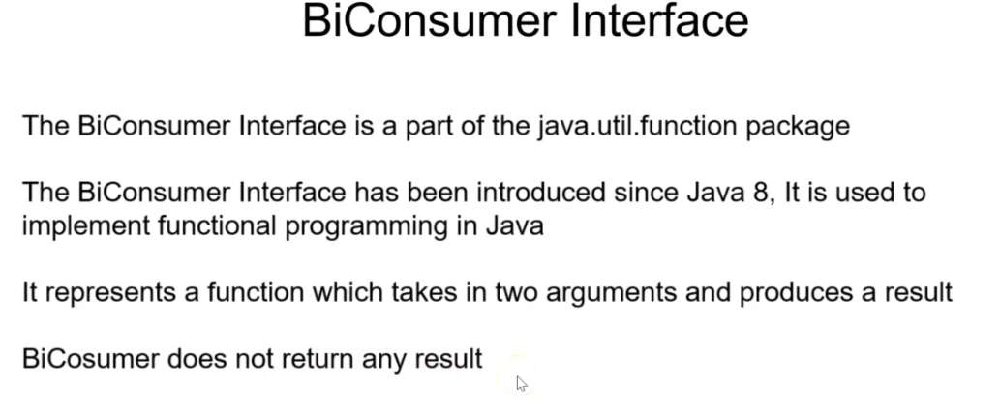

* Biconsumer Examples
1. https://github.com/jdbirla/JD_JAVA_Learning/blob/master/Java_8_9_10_11_12_13/LambdaExpression/src/com/modernjava/funcprogramming/BiConsumerExample.java
2. https://github.com/jdbirla/JD_JAVA_Learning/blob/master/Java_8_9_10_11_12_13/LambdaExpression/src/com/modernjava/funcprogramming/ConsumerExample3.java

### Predicate
 

