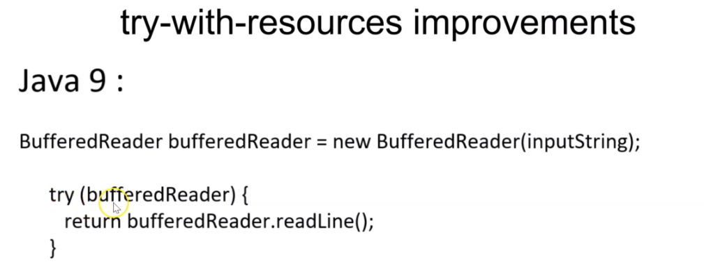
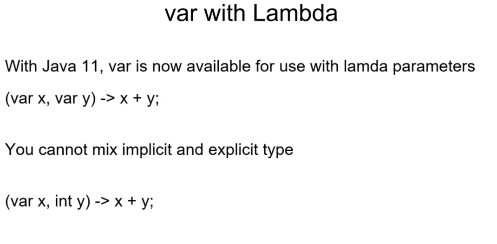

# Java_8_9_10_11_12_13
- URL : https://www.udemy.com/course/java-latest-programming-from-zero-java13-java12-java11-java10-java9-j8/learn/lecture/17818988#overview
- Common SQL Clauses and Their Equivalents in Java 8 Streams https://dzone.com/articles/common-sql-clauses-and-their-equivalents-in-java-8-1

|SQL  |JAVA API
|---  |--- 
|FROM	|of(),stream()
|WHERE	|filter()
|	SELECT RESULT	|	Collect(Collector.toList()) //toSet(),toCollection(Supplier<C> collectionFactory)
|	Concatinate all the colums	|productList.stream().map(Product::getName).collect(Collectors.joining("", "", ""["", ""]""));"
|	Sum	|int summingPrice = productList.stream() .collect(Collectors.summingInt(Product::getPrice));"
|	Average	|double averagePrice = productList.stream()  .collect(Collectors.averagingInt(Product::getPrice));
|	Collecting statistical information	|	"IntSummaryStatistics statistics = productList.stream().collect(Collectors.summarizingInt(Product::getPrice));"
|	Group BY	|Map<Integer, List<Product>> collectorMapOfLists=productList.stream()  .collect(Collectors.groupingBy(Product::getPrice));"
|	PartitionBy	|	"Map<Boolean, List<Product>> mapPartioned = productList.stream().collect(Collectors.partitioningBy(element -> element.getPrice() > 15));"
|	Group BY and select from Outer Query	|	Set<Product> unmodifiableSet = productList.stream() .collect(Collectors.collectingAndThen(Collectors.toSet(), Collections::unmodifiableSet));

- 

## Section 1: Introduction

---

## Section 2: Lambda Expressions

* Example 
https://github.com/jdbirla/JD_JAVA_Learning/blob/master/Java_8_9_10_11_12_13/LambdaExpression/src/com/modernjava/lambda/SumOfNumbersUsingCallable.java

---
## Section 3: Functional Interfaces and Lambda

* Consumer example 
1. https://github.com/jdbirla/JD_JAVA_Learning/blob/master/Java_8_9_10_11_12_13/LambdaExpression/src/com/modernjava/funcprogramming/ConsumerExample.java
2. https://github.com/jdbirla/JD_JAVA_Learning/blob/master/Java_8_9_10_11_12_13/LambdaExpression/src/com/modernjava/funcprogramming/ConsumerExample2.java
3. https://github.com/jdbirla/JD_JAVA_Learning/blob/master/Java_8_9_10_11_12_13/LambdaExpression/src/com/modernjava/funcprogramming/ConsumerExample3.java

### Biconsumer 

* Biconsumer Examples
1. https://github.com/jdbirla/JD_JAVA_Learning/blob/master/Java_8_9_10_11_12_13/LambdaExpression/src/com/modernjava/funcprogramming/BiConsumerExample.java
2. https://github.com/jdbirla/JD_JAVA_Learning/blob/master/Java_8_9_10_11_12_13/LambdaExpression/src/com/modernjava/funcprogramming/ConsumerExample3.java

### Predicate         
 

1. https://github.com/jdbirla/JD_JAVA_Learning/blob/master/Java_8_9_10_11_12_13/LambdaExpression/src/com/modernjava/funcprogramming/PredicateExample.java
2. https://github.com/jdbirla/JD_JAVA_Learning/blob/master/Java_8_9_10_11_12_13/LambdaExpression/src/com/modernjava/funcprogramming/PredicateExample2.java
3. https://github.com/jdbirla/JD_JAVA_Learning/blob/master/Java_8_9_10_11_12_13/LambdaExpression/src/com/modernjava/funcprogramming/PredicateExample3.java
* PredicateAndBiConsumerExample
4. https://github.com/jdbirla/JD_JAVA_Learning/blob/master/Java_8_9_10_11_12_13/LambdaExpression/src/com/modernjava/funcprogramming/PredicateAndBiConsumerExample.java
* BiPredicateExample
5. https://github.com/jdbirla/JD_JAVA_Learning/blob/master/Java_8_9_10_11_12_13/LambdaExpression/src/com/modernjava/funcprogramming/BiPredicateExample.java

### Function Interface

1. https://github.com/jdbirla/JD_JAVA_Learning/blob/master/Java_8_9_10_11_12_13/LambdaExpression/src/com/modernjava/funcprogramming/FunctionExample.java
2. https://github.com/jdbirla/JD_JAVA_Learning/blob/master/Java_8_9_10_11_12_13/LambdaExpression/src/com/modernjava/funcprogramming/FunctionExample2.java

### BiFunction Interface

1. https://github.com/jdbirla/JD_JAVA_Learning/blob/master/Java_8_9_10_11_12_13/LambdaExpression/src/com/modernjava/funcprogramming/BiFunctionExample.java

### Unary Operator

1. https://github.com/jdbirla/JD_JAVA_Learning/blob/master/Java_8_9_10_11_12_13/LambdaExpression/src/com/modernjava/funcprogramming/UnaryOperatorExample.java

### Binary Operator

1. https://github.com/jdbirla/JD_JAVA_Learning/blob/master/Java_8_9_10_11_12_13/LambdaExpression/src/com/modernjava/funcprogramming/BinaryOperatorExample.java

### Supplier Interface

1. https://github.com/jdbirla/JD_JAVA_Learning/blob/master/Java_8_9_10_11_12_13/LambdaExpression/src/com/modernjava/funcprogramming/SupplierExample.java

### Method Reference

1. https://github.com/jdbirla/JD_JAVA_Learning/blob/master/Java_8_9_10_11_12_13/LambdaExpression/src/com/modernjava/funcprogramming/MethodReferenceExample.java
2. https://github.com/jdbirla/JD_JAVA_Learning/blob/master/Java_8_9_10_11_12_13/LambdaExpression/src/com/modernjava/funcprogramming/ConvertToMethodReferenceExample.java

## Java8 FunctionalInterfaces with Methods

---
## Section 4: Lambda Variable Scope

1. https://github.com/jdbirla/JD_JAVA_Learning/blob/master/Java_8_9_10_11_12_13/LambdaExpression/src/com/modernjava/funcprogramming/VariableScope.java

---
## Section 5: Bank Transfer

1. https://github.com/jdbirla/JD_JAVA_Learning/tree/master/Java_8_9_10_11_12_13/LambdaExpression/src/com/modernjava/funcprogramming/realexample

---
## Section 6: Streams

### Debug Stream using peek method
1. https://github.com/jdbirla/JD_JAVA_Learning/blob/master/Java_8_9_10_11_12_13/LambdaExpression/src/com/modernjava/streams/StreamExample.java

1. https://github.com/jdbirla/JD_JAVA_Learning/blob/master/Java_8_9_10_11_12_13/LambdaExpression/src/com/modernjava/streams/StreamVsCollectionExample.java

---
## Section 7: Streams Operations

### Map

1. https://github.com/jdbirla/JD_JAVA_Learning/blob/master/Java_8_9_10_11_12_13/LambdaExpression/src/com/modernjava/streams/MapExample.java

### FlatMap

1. https://github.com/jdbirla/JD_JAVA_Learning/blob/master/Java_8_9_10_11_12_13/LambdaExpression/src/com/modernjava/streams/FlatMapExample.java

### distinct,count,sorted, allmatch

1. https://github.com/jdbirla/JD_JAVA_Learning/blob/master/Java_8_9_10_11_12_13/LambdaExpression/src/com/modernjava/streams/StreamsOperations.java

### customized sort using comparator

1. https://github.com/jdbirla/JD_JAVA_Learning/blob/master/Java_8_9_10_11_12_13/LambdaExpression/src/com/modernjava/streams/StreamComparatorExample.java

### filter

1. https://github.com/jdbirla/JD_JAVA_Learning/blob/master/Java_8_9_10_11_12_13/LambdaExpression/src/com/modernjava/streams/FilterExample.java

### Reduce

1. https://github.com/jdbirla/JD_JAVA_Learning/blob/master/Java_8_9_10_11_12_13/LambdaExpression/src/com/modernjava/streams/StreamReduceExample.java
2. https://github.com/jdbirla/JD_JAVA_Learning/blob/master/Java_8_9_10_11_12_13/LambdaExpression/src/com/modernjava/streams/StreamReduceExample2.java

### map + filter + reduce

1. https://github.com/jdbirla/JD_JAVA_Learning/blob/master/Java_8_9_10_11_12_13/LambdaExpression/src/com/modernjava/streams/StreamMapFilterReduceExample.java

### Max 
1. https://github.com/jdbirla/JD_JAVA_Learning/blob/master/Java_8_9_10_11_12_13/LambdaExpression/src/com/modernjava/streams/StreamMaxExample.java

### Min 
1. https://github.com/jdbirla/JD_JAVA_Learning/blob/master/Java_8_9_10_11_12_13/LambdaExpression/src/com/modernjava/streams/StreamMinExample.java

### limit and skip
1. https://github.com/jdbirla/JD_JAVA_Learning/blob/master/Java_8_9_10_11_12_13/LambdaExpression/src/com/modernjava/streams/StreamLimitAndSkipExample.java

### findAny() and findFirst()
1. https://github.com/jdbirla/JD_JAVA_Learning/blob/master/Java_8_9_10_11_12_13/LambdaExpression/src/com/modernjava/streams/StreamFindAnyAndFirstExample.java

---
## Section 8: Streams Generators

1. https://github.com/jdbirla/JD_JAVA_Learning/blob/master/Java_8_9_10_11_12_13/LambdaExpression/src/com/modernjava/streams/StreamFactoryMethodExample.java

---
## Section 9: Numeric Streams

### intStream,LongStream,DoubleStream
1. https://github.com/jdbirla/JD_JAVA_Learning/blob/master/Java_8_9_10_11_12_13/LambdaExpression/src/com/modernjava/streams/IntStreamExample.java
2. https://github.com/jdbirla/JD_JAVA_Learning/blob/master/Java_8_9_10_11_12_13/LambdaExpression/src/com/modernjava/streams/LongStreamExample.java
3. https://github.com/jdbirla/JD_JAVA_Learning/blob/master/Java_8_9_10_11_12_13/LambdaExpression/src/com/modernjava/streams/DoubleStreamExample.java

### Numeric Stream Aggregate Functions

1. https://github.com/jdbirla/JD_JAVA_Learning/blob/master/Java_8_9_10_11_12_13/LambdaExpression/src/com/modernjava/streams/NumericStreamAggregateExample.java

### Boxing and Unboxing

1. https://github.com/jdbirla/JD_JAVA_Learning/blob/master/Java_8_9_10_11_12_13/LambdaExpression/src/com/modernjava/streams/BoxingUnBoxingExample.java
2. https://github.com/jdbirla/JD_JAVA_Learning/blob/master/Java_8_9_10_11_12_13/LambdaExpression/src/com/modernjava/streams/MapToObjLongDoubleExample.java

---
## Section 10: Collectors Operations

### joining

1.  https://github.com/jdbirla/JD_JAVA_Learning/blob/master/Java_8_9_10_11_12_13/LambdaExpression/src/com/modernjava/streams/JoiningExample.java

### counting

1. https://github.com/jdbirla/JD_JAVA_Learning/blob/master/Java_8_9_10_11_12_13/LambdaExpression/src/com/modernjava/streams/CountingExample.java

### mapping

1. https://github.com/jdbirla/JD_JAVA_Learning/blob/master/Java_8_9_10_11_12_13/LambdaExpression/src/com/modernjava/streams/CollectorMappingExample.java

### minby() and maxBy()

1. https://github.com/jdbirla/JD_JAVA_Learning/blob/master/Java_8_9_10_11_12_13/LambdaExpression/src/com/modernjava/streams/CollectorsMinMaxExample.java

### summingInt() and averagingInt()

1. https://github.com/jdbirla/JD_JAVA_Learning/blob/master/Java_8_9_10_11_12_13/LambdaExpression/src/com/modernjava/streams/CollectorSummingAveragingExample.java

### groupingBy

1. https://github.com/jdbirla/JD_JAVA_Learning/blob/master/Java_8_9_10_11_12_13/LambdaExpression/src/com/modernjava/streams/GroupingByExample1.java

2. https://github.com/jdbirla/JD_JAVA_Learning/blob/master/Java_8_9_10_11_12_13/LambdaExpression/src/com/modernjava/streams/GroupingExample2.java

3. https://github.com/jdbirla/JD_JAVA_Learning/blob/master/Java_8_9_10_11_12_13/LambdaExpression/src/com/modernjava/streams/GroupingExample3.java

### GroupingMinMaxAvgExample

1. https://github.com/jdbirla/JD_JAVA_Learning/blob/master/Java_8_9_10_11_12_13/LambdaExpression/src/com/modernjava/streams/GroupingMinMaxAvgExample.java

#### partitioningBy()

1. https://github.com/jdbirla/JD_JAVA_Learning/blob/master/Java_8_9_10_11_12_13/LambdaExpression/src/com/modernjava/streams/PartitioningByExample.java

---
## Section 11: Parallel Stream

1. https://github.com/jdbirla/JD_JAVA_Learning/blob/master/Java_8_9_10_11_12_13/LambdaExpression/src/com/modernjava/parallelstream/ParallelStreamExample.java
2. https://github.com/jdbirla/JD_JAVA_Learning/blob/master/Java_8_9_10_11_12_13/LambdaExpression/src/com/modernjava/parallelstream/StreamPerformanceExample.java
3. https://github.com/jdbirla/JD_JAVA_Learning/blob/master/Java_8_9_10_11_12_13/LambdaExpression/src/com/modernjava/parallelstream/StreamPerformanceExample1.java

---
## Section 12: Optional java8+

1. https://github.com/jdbirla/JD_JAVA_Learning/blob/master/Java_8_9_10_11_12_13/LambdaExpression/src/com/modernjava/optional/OptionalExample.java
2. https://github.com/jdbirla/JD_JAVA_Learning/blob/master/Java_8_9_10_11_12_13/LambdaExpression/src/com/modernjava/optional/OptionalIfIsExample.java
3. https://github.com/jdbirla/JD_JAVA_Learning/blob/master/Java_8_9_10_11_12_13/LambdaExpression/src/com/modernjava/optional/OptionalOfEmptyExample.java
4. https://github.com/jdbirla/JD_JAVA_Learning/blob/master/Java_8_9_10_11_12_13/LambdaExpression/src/com/modernjava/optional/OptionalOrElseThrowExample.java

---
## Section 13: Default and Static Methods ot Interfaces 

1. https://github.com/jdbirla/JD_JAVA_Learning/tree/master/Java_8_9_10_11_12_13/LambdaExpression/src/com/modernjava/defaults

---
## Section 14: New DateTime APIs

---
## Section 15:Java Shell(REPL)- Java9+

---
## Section 16 : Module System- Java9+

---
## Section 17: Factory Methods for Collection - Java9+

1. https://github.com/jdbirla/JD_JAVA_Learning/blob/master/Java_8_9_10_11_12_13/LambdaExpression/src/com/modernjava/factorymethods/FactoryMethodsExample.java

---
## Section 18: Try-with-resources - Java9+

1. https://github.com/jdbirla/JD_JAVA_Learning/blob/master/Java_8_9_10_11_12_13/LambdaExpression/src/com/modernjava/java9improvements/TryWithResourcesExample.java

---
## Section 19: Try Interference with var - Java10+

1. https://github.com/jdbirla/JD_JAVA_Learning/blob/master/Java_8_9_10_11_12_13/LambdaExpression/src/com/modernjava/javaimprovements/TypeInterferenceExample.java

---
## Section 20: GC1 Improvements- Java 10+

---
## Section 21: var with Lambda - Java11+

1. https://github.com/jdbirla/JD_JAVA_Learning/blob/master/Java_8_9_10_11_12_13/LambdaExpression/src/com/modernjava/javaimprovements/VarWithLambdaExample.java

---
## Section 22: Epsilon GC - Java11+

---
## Section 23: New Http Client - Java11+

1. https://github.com/jdbirla/JD_JAVA_Learning/blob/master/Java_8_9_10_11_12_13/LambdaExpression/src/com/modernjava/javaimprovements/HttpClientExample.java
2. https://github.com/jdbirla/JD_JAVA_Learning/blob/master/Java_8_9_10_11_12_13/LambdaExpression/src/com/modernjava/javaimprovements/AsyncHttpClient.java

---
## Section 24: Switch Expression - Java12+

1. https://github.com/jdbirla/JD_JAVA_Learning/blob/master/Java_8_9_10_11_12_13/LambdaExpression/src/com/modernjava/java9improvements/SwitchStatementExample.java
2. https://github.com/jdbirla/JD_JAVA_Learning/blob/master/Java_8_9_10_11_12_13/LambdaExpression/src/com/modernjava/java9improvements/SwitchExpressionsExample1.java
3. https://github.com/jdbirla/JD_JAVA_Learning/blob/master/Java_8_9_10_11_12_13/LambdaExpression/src/com/modernjava/java9improvements/SwitchExpressionExample2.java
---
## Section 25: Switch Expression Enhancements- Java13+

1. https://github.com/jdbirla/JD_JAVA_Learning/blob/master/Java_8_9_10_11_12_13/LambdaExpression/src/com/modernjava/java9improvements/SwitchExpressionEnhancementExample.java
---
## Section 26: Text Blocks - Java13+

1. https://github.com/jdbirla/JD_JAVA_Learning/blob/master/Java_8_9_10_11_12_13/LambdaExpression/src/com/modernjava/java9improvements/MultiLineTextBlockExample.java

---

