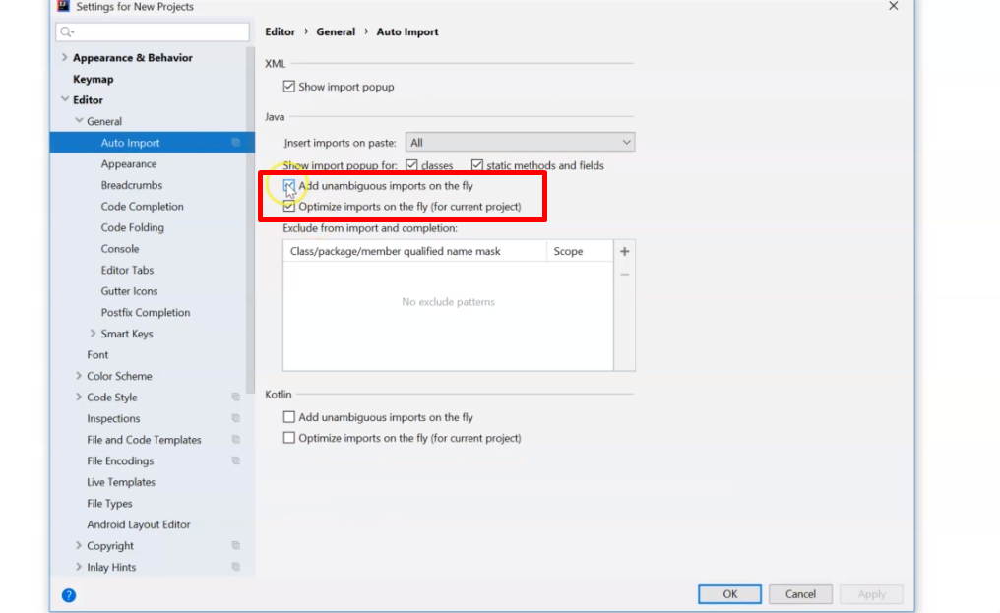
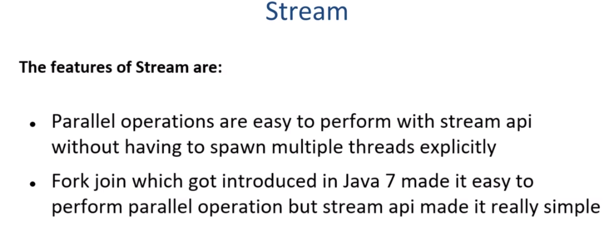

# Java_8_9_10_11_12_13
- URL : https://www.udemy.com/course/java-latest-programming-from-zero-java13-java12-java11-java10-java9-j8/learn/lecture/17818988#overview
- Common SQL Clauses and Their Equivalents in Java 8 Streams https://dzone.com/articles/common-sql-clauses-and-their-equivalents-in-java-8-1
- 

## Section 1: Introduction

---

## Section 2: Lambda Expressions

* Example 
https://github.com/jdbirla/JD_JAVA_Learning/blob/master/Java_8_9_10_11_12_13/LambdaExpression/src/com/modernjava/lambda/SumOfNumbersUsingCallable.java

---
## Section 3: Functional Interfaces and Lambda

* Consumer example 
1. https://github.com/jdbirla/JD_JAVA_Learning/blob/master/Java_8_9_10_11_12_13/LambdaExpression/src/com/modernjava/funcprogramming/ConsumerExample.java
2. https://github.com/jdbirla/JD_JAVA_Learning/blob/master/Java_8_9_10_11_12_13/LambdaExpression/src/com/modernjava/funcprogramming/ConsumerExample2.java
3. https://github.com/jdbirla/JD_JAVA_Learning/blob/master/Java_8_9_10_11_12_13/LambdaExpression/src/com/modernjava/funcprogramming/ConsumerExample3.java

### Biconsumer 

* Biconsumer Examples
1. https://github.com/jdbirla/JD_JAVA_Learning/blob/master/Java_8_9_10_11_12_13/LambdaExpression/src/com/modernjava/funcprogramming/BiConsumerExample.java
2. https://github.com/jdbirla/JD_JAVA_Learning/blob/master/Java_8_9_10_11_12_13/LambdaExpression/src/com/modernjava/funcprogramming/ConsumerExample3.java

### Predicate         
 

1. https://github.com/jdbirla/JD_JAVA_Learning/blob/master/Java_8_9_10_11_12_13/LambdaExpression/src/com/modernjava/funcprogramming/PredicateExample.java
2. https://github.com/jdbirla/JD_JAVA_Learning/blob/master/Java_8_9_10_11_12_13/LambdaExpression/src/com/modernjava/funcprogramming/PredicateExample2.java
3. https://github.com/jdbirla/JD_JAVA_Learning/blob/master/Java_8_9_10_11_12_13/LambdaExpression/src/com/modernjava/funcprogramming/PredicateExample3.java
* PredicateAndBiConsumerExample
4. https://github.com/jdbirla/JD_JAVA_Learning/blob/master/Java_8_9_10_11_12_13/LambdaExpression/src/com/modernjava/funcprogramming/PredicateAndBiConsumerExample.java
* BiPredicateExample
5. https://github.com/jdbirla/JD_JAVA_Learning/blob/master/Java_8_9_10_11_12_13/LambdaExpression/src/com/modernjava/funcprogramming/BiPredicateExample.java

### Function Interface

1. https://github.com/jdbirla/JD_JAVA_Learning/blob/master/Java_8_9_10_11_12_13/LambdaExpression/src/com/modernjava/funcprogramming/FunctionExample.java
2. https://github.com/jdbirla/JD_JAVA_Learning/blob/master/Java_8_9_10_11_12_13/LambdaExpression/src/com/modernjava/funcprogramming/FunctionExample2.java

### BiFunction Interface

1. https://github.com/jdbirla/JD_JAVA_Learning/blob/master/Java_8_9_10_11_12_13/LambdaExpression/src/com/modernjava/funcprogramming/BiFunctionExample.java

### Unary Operator

1. https://github.com/jdbirla/JD_JAVA_Learning/blob/master/Java_8_9_10_11_12_13/LambdaExpression/src/com/modernjava/funcprogramming/UnaryOperatorExample.java

### Binary Operator

1. https://github.com/jdbirla/JD_JAVA_Learning/blob/master/Java_8_9_10_11_12_13/LambdaExpression/src/com/modernjava/funcprogramming/BinaryOperatorExample.java

### Supplier Interface

1. https://github.com/jdbirla/JD_JAVA_Learning/blob/master/Java_8_9_10_11_12_13/LambdaExpression/src/com/modernjava/funcprogramming/SupplierExample.java

### Method Reference

1. https://github.com/jdbirla/JD_JAVA_Learning/blob/master/Java_8_9_10_11_12_13/LambdaExpression/src/com/modernjava/funcprogramming/MethodReferenceExample.java
2. https://github.com/jdbirla/JD_JAVA_Learning/blob/master/Java_8_9_10_11_12_13/LambdaExpression/src/com/modernjava/funcprogramming/ConvertToMethodReferenceExample.java

## Java8 FunctionalInterfaces with Methods

---
## Section 4: Lambda Variable Scope

1. https://github.com/jdbirla/JD_JAVA_Learning/blob/master/Java_8_9_10_11_12_13/LambdaExpression/src/com/modernjava/funcprogramming/VariableScope.java

---
## Section 5: Bank Transfer

1. https://github.com/jdbirla/JD_JAVA_Learning/tree/master/Java_8_9_10_11_12_13/LambdaExpression/src/com/modernjava/funcprogramming/realexample

---
## Section 6: Streams

### Debug Stream using peek method
1. https://github.com/jdbirla/JD_JAVA_Learning/blob/master/Java_8_9_10_11_12_13/LambdaExpression/src/com/modernjava/streams/StreamExample.java

1. https://github.com/jdbirla/JD_JAVA_Learning/blob/master/Java_8_9_10_11_12_13/LambdaExpression/src/com/modernjava/streams/StreamVsCollectionExample.java

---
## Section 7: Streams Operations

### Map

1. https://github.com/jdbirla/JD_JAVA_Learning/blob/master/Java_8_9_10_11_12_13/LambdaExpression/src/com/modernjava/streams/MapExample.java

